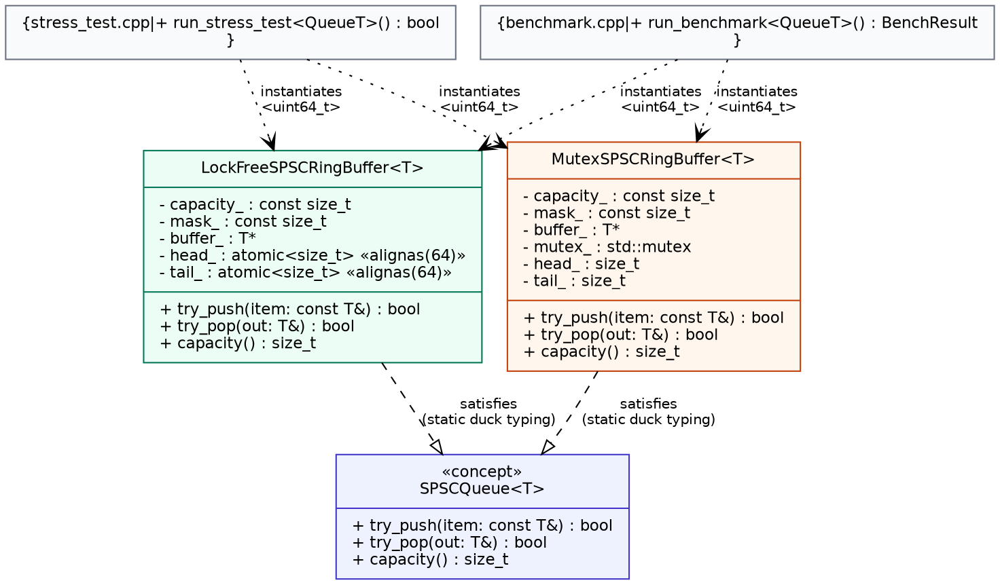

# SPSC Ring Buffer

A single-producer/single-consumer lock-free ring buffer in C++20, benchmarked against a mutex-based baseline and validated for correctness under concurrent load with a stress test and ThreadSanitizer.

## Overview

This project implements a bounded SPSC queue two ways:

- **`LockFreeSPSCRingBuffer<T>`** — `std::atomic` with `acquire`/`release` ordering, no locks, no CAS.
- **`MutexSPSCRingBuffer<T>`** — identical algorithm, `std::mutex`-protected. Used as a correctness reference and the benchmark baseline.

Both expose the same interface and are validated by the same stress test.

## Architecture

<p align="center">
  
</p>

Both classes are templates with an identical public surface (`try_push`, `try_pop`, `capacity`) but no shared base class — the contract is enforced by usage (static duck typing), not inheritance, which is idiomatic for header-only C++ templates. `stress_test.cpp` and `benchmark.cpp` each instantiate both for `uint64_t` and drive them through the same test/measurement code.

## Design decisions

| Decision | Rationale |
|---|---|
| Power-of-two capacity, bitmask indexing (`i & (size - 1)`) | Avoids modulo on the hot path. |
| Sacrifice one slot to disambiguate full vs. empty | Simpler than a separate atomic counter; one fewer shared variable to synchronize. |
| `acquire`/`release` on `head_`/`tail_`, not `seq_cst` | Only a pairwise happens-before between producer and consumer is needed — `seq_cst`'s global total order is unused overhead here. |
| `alignas(64)` on `head_` and `tail_` | Both are written every push/pop by different threads; without padding they false-share a cache line. Not applied to `capacity_`/`mask_`/`buffer_`, which are write-once. |
| Raw buffer + placement new instead of `std::array`/`std::vector` | Avoids requiring `T` to be default-constructible and avoids keeping "empty" slots holding live objects. |
| No multi-writer synchronization tricks | Out of scope for SPSC — each index has exactly one writer, so there's no race between multiple writers to resolve in the first place. |

## Build

Requires a C++20 compiler and GNU Make.

```
make            # builds bin/stress_test, bin/benchmark, bin/false_sharing_demo
make stress-tsan  # ThreadSanitizer build (see Testing)
make clean
```

## Usage

```cpp
#include "include/lockfree_spsc_ring_buffer.hpp"

LockFreeSPSCRingBuffer<int> queue(1024);  // capacity rounded up internally

queue.try_push(42);   // false if full

int value;
queue.try_pop(value); // false if empty
```

## Testing

```
./bin/stress_test
```

Pushes 20M sequential values through both queues on real producer/consumer threads and verifies the consumer receives them all, unmodified, in order.

```
make stress-tsan && ./bin/stress_test_tsan
```

Same test, compiled with `-fsanitize=thread`. Catches races that are possible under the C++ memory model even if a given run doesn't happen to produce visibly corrupt data — a plain stress test alone can't guarantee that.

Both currently pass clean.

## Benchmarks

```
./bin/benchmark
./bin/false_sharing_demo
```

Measured on a 4-core Intel Core i5-1155G7:

| | Throughput | p50 | p99 | p999 |
|---|---|---|---|---|
| Mutex baseline | 3.35 M ops/sec | 118 ns | 1317 ns | 2467 ns |
| Lock-free | 17.45 M ops/sec | 21 ns | 110 ns | 137 ns |

**5.2x higher throughput, ~12x lower p99 latency.** The gap is driven mainly by kernel scheduling overhead the mutex version incurs under contention — the lock-free version never blocks a thread, so it has no equivalent tail cost.

`false_sharing_demo` isolates the cache-line padding effect on an adversarial counter-increment workload (not representative of the ring buffer's own per-op cost, which does more work per operation): **2.67x** faster padded vs. unpadded on the same 4-core machine.

## Project structure

```
include/
  lockfree_spsc_ring_buffer.hpp   lock-free queue (header-only: template)
  mutex_spsc_ring_buffer.hpp      mutex baseline (header-only: template)
test/
  stress_test.cpp                 correctness under real concurrency
bench/
  benchmark.cpp                   throughput + latency percentiles
  false_sharing_demo.cpp          isolated cache-padding effect
docs/
  uml_class_diagram.dot/.svg/.png
Makefile
```

## Scope

SPSC only. Supporting multiple producers or consumers is a meaningfully different, harder problem — multiple threads would be racing to update the same index, which this design's single-writer-per-index assumption doesn't handle. Deliberately left out here rather than solved incorrectly.

